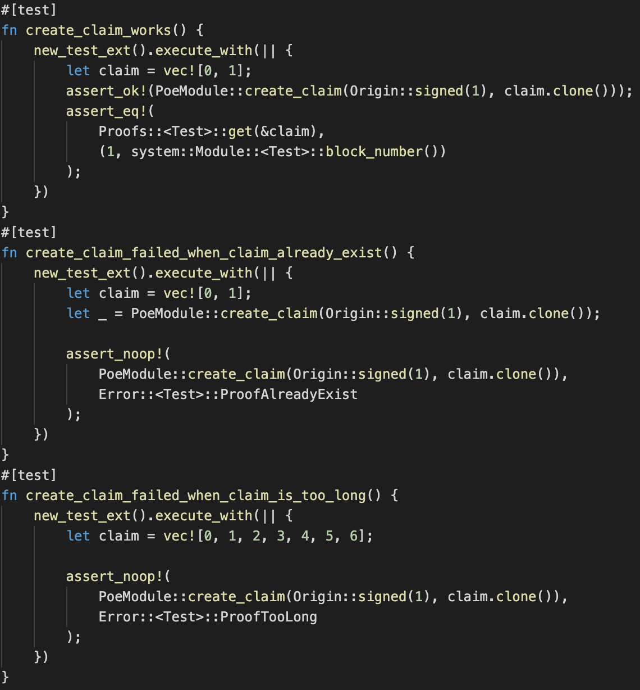
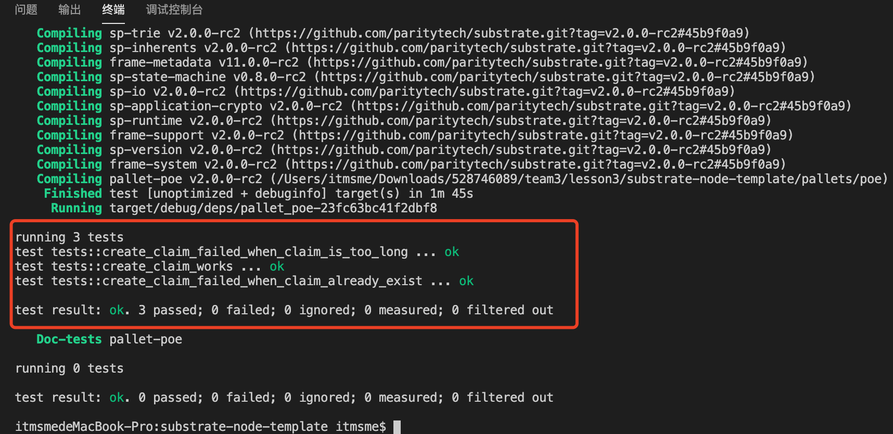
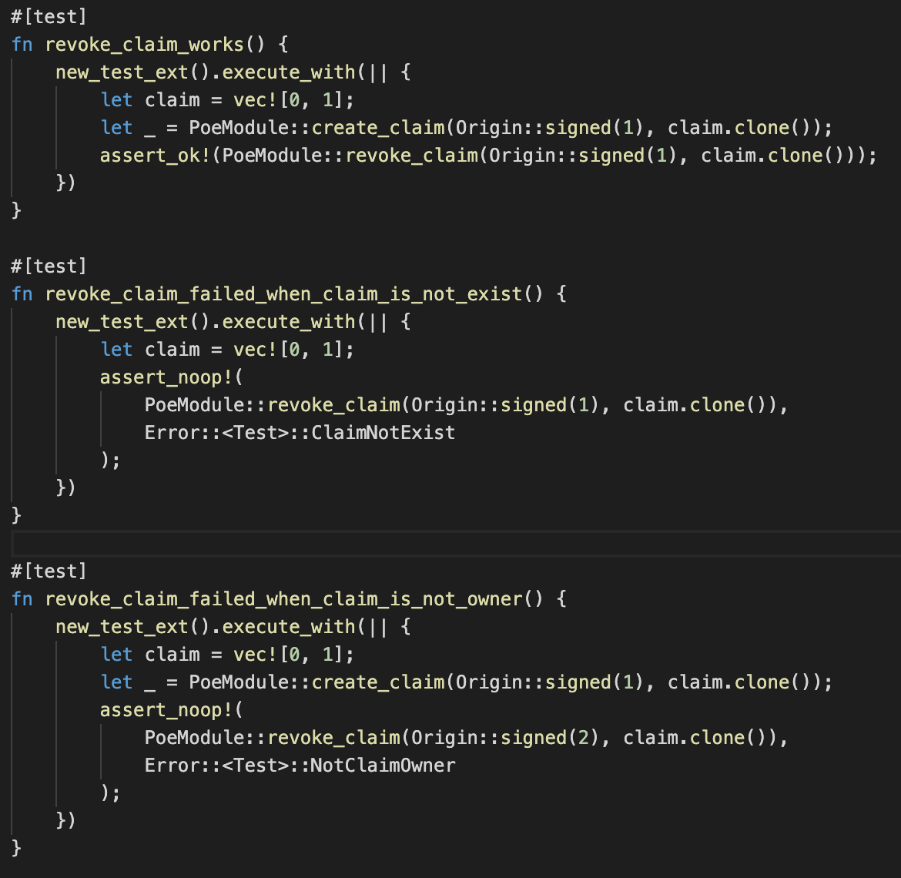
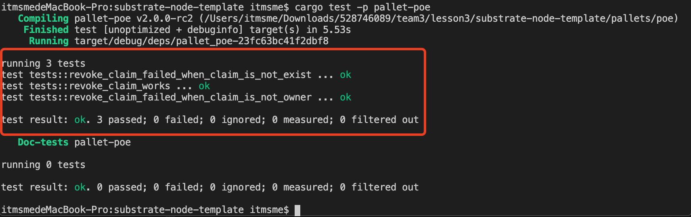
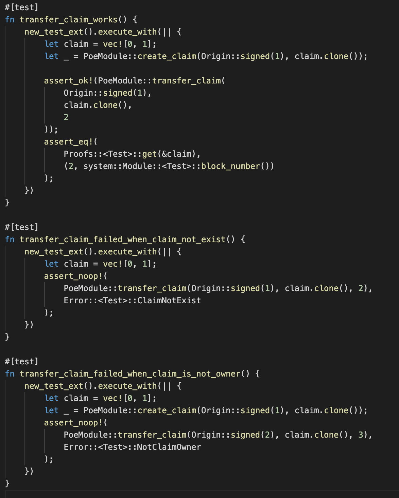
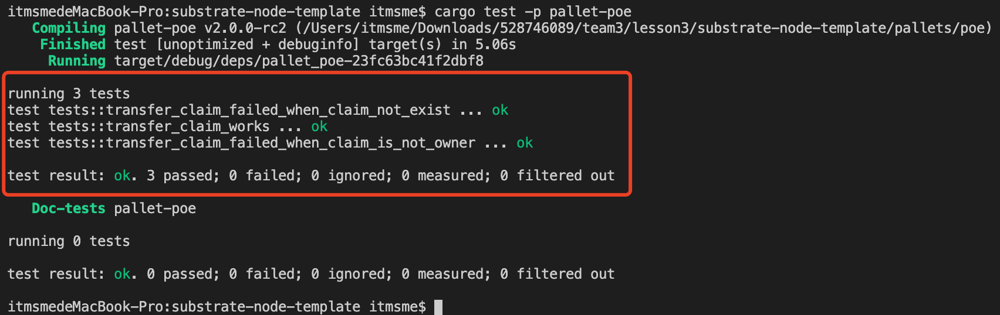
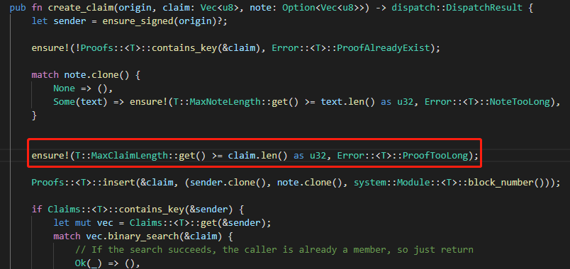
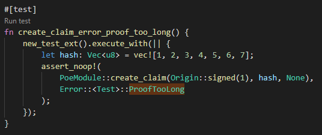

## 第一课作业

第一题：编写存证模块的单元测试代码，包括：

* 创建存证的测试用例；

完成创建存证测试用例代码

完成创建存证测试用例演示

* 撤销存证的测试用例；

完成撤销存证测试用例代码

完成撤销存证测试用例演示

* 转移存证的测试用例；

完成转移存证测试用例代码

完成转移存证测试用例演示

第二题：创建存证时为存证内容的哈希值Vec<u8>

* 设置长度上限，超过限制时返回错误

* 测试用例

